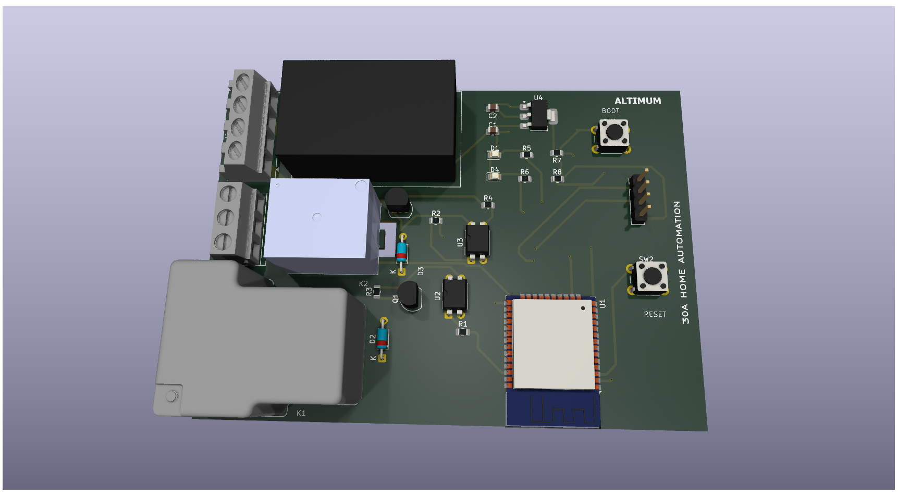
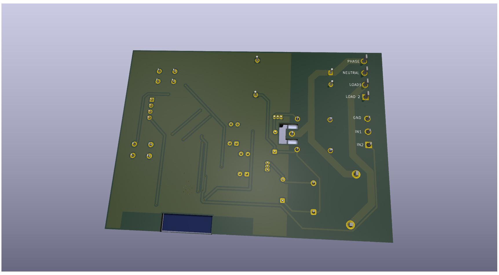

# 30 A HOME AUTOMATION PCB Design using KICAD -ALTIMUM
## PCB TOP VIEW

## PCB BOTTOM VIEW

## Project Overview🔧
This KiCad-designed 30 A home automation circuit integrates power regulation, microcontroller control, and relay-based switching to automate high-power loads. The power supply section converts AC input to a regulated 5 V using an HLK-PM01 module, which is further stepped down to 3.3 V via an AMS1117 regulator to safely power the ESP32-WROOM-32 MCU and logic circuitry. The ESP32 acts as the brain, receiving inputs through switches and UART communication, while providing control signals to the relay driver stage. Each relay channel uses an S8050 transistor to amplify the MCU’s low-current GPIO signals, driving the relay coils, with flyback diodes protecting against voltage spikes. Optocouplers (PC817) provide electrical isolation between the low-power control side and high-power relay side, improving safety and reliability. Status LEDs indicate operation, while dedicated reset and boot circuits ensure proper initialization of the ESP32. Overall, the system enables safe and efficient control of high-current household appliances, making it a practical implementation of a smart home automation module developed as part of learning PCB design using KiCad.
